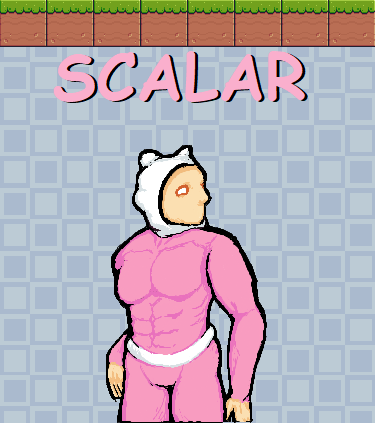

# Scalar
This program is a simple game implemented using the Pygame library. The game involves a player character navigating a series of platforms by moving left, right, and jumping.
## Program Structure
Scalar consists of several modules and threads that work together to create the game. Here is an overview of the main components:
## 1. Main Thread
The main thread controls the game loop, handles events, and manages the overall flow of the game. It initializes the Pygame library, creates and starts the necessary threads, and continuously updates and draws the game scene until the game ends.
## 2. Player Handler Thread
This thread is responsible for handling player movement. It continuously checks for input from the player and updates the player's position accordingly. It also detects and handles collisions with the platforms, preventing the player from moving through them.
## 3. Platform Handler Thread
The platform handler thread generates and moves the platforms in the game. It generates new platforms at random heights and adds them to the list of platforms. It also moves the platforms to the left at a gradually increasing speed, creating the illusion of the player moving forward. The thread is responsible for managing the generation, movement, and removal of platforms.
## Mutexes
The program uses a mutex (lock) to ensure thread safety when accessing shared data structures, such as the list of platforms. The mutex is created using the threading.Lock() class and is acquired and released using the with lock statement to ensure exclusive access to critical sections of code.
## Classes
The program defines several classes:
### Block Class
The Block class represents a platform block in the game. It inherits from the basics.Object class and defines methods for initializing and updating the block's position. Each block is rendered as an image using Pygame's Surface class, and collision detection is performed using a pixel-perfect mask.
### Player Class
The Player class represents the player character in the game. It inherits from the py.sprite.Sprite class and defines methods for handling player movement, animation, and collision detection. The player's movement is controlled by keyboard input, and animations are played based on the player's state (idle, running, jumping, falling).
## Game Logic
The game logic revolves around the interaction between the player and the platforms. The player's movement is governed by the player handler thread, which checks for input and updates the player's position. The platform handler thread generates, moves, and removes platforms, creating a challenging path for the player to navigate.
Collision detection is performed between the player and the platforms to prevent the player from passing through them. The collision detection accounts for both vertical and horizontal collisions and adjusts the player's position and velocity accordingly.
The game ends when the player falls below the screen, triggering a game over state.
## Running the Program
To run the program, ensure that the necessary dependencies are installed (Pygame) and execute the main script. The game window will open, and the player can control the character using the arrow keys to move left or right and the space bar to jump. The objective is to navigate the platforms and reach as far as possible without falling. If the player falls below the screen, the game ends, and a game over message is displayed.
Note: The program assumes that the required assets, such as images and sound effects, are available in the specified directories.

